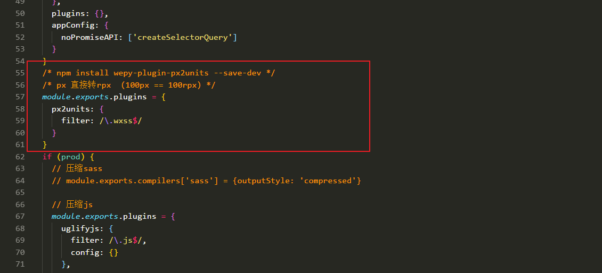

# wepy 框架使用使用

GitHub 项目地址：https://github.com/Tencent/wepy

wepy 官网：https://tencent.github.io/wepy/

# 全局安装 wepy

```javascript
/* 全局安装 wepy */
npm install -g wepy-cli
/* 输出 wepy 版本号，验证 wepy 是否安装成功 */
wepy -v
```

# 起步

```javascript
/* 1.初始化 wepy项目 两种方式 */
(1) wepy init standard my-project  -----(my-project 是项目名)
	开启了promise、Async Function 等

(2) wepy init empty my-project  -----(my-project 是项目名)   推荐
    空模板 后面可以自己配
```

```javascript
/* 2.进入项目文件夹 */
cd my-project  -----(my-project 是项目名)
```

```javascript
/* 3.npm i  下载依赖包 */
  有时报错
  npm ERR! Unexpected end of JSON input while parsing near '...uilder-binary-assignm'

 解决方案 执行代码
 npm cache clean --force
```


解决方案 执行代码


```
/* 4.编译 wepy 项目 */
wepy build --watch
```

```javascript
/* 5.导入 微信web开发者工具 */
```

# wepy 项目 Promise 插件导入步骤图解

- **进入项目根目录，安装 polyfill**

```javascript
npm install wepy-async-function --save
```

- **在 app.wpy 中引入 polyfill**

```
import 'wepy-async-function';
```

- **在 app.wpy 中使 API promise 化**

```
export default class extends wepy.app {
   constructor() {
    super()
    /* 挂载 promise化 */
    this.use('promisify')
  }
}
```

## 图解

网址： https://github.com/Tencent/wepy/wiki/wepy%E9%A1%B9%E7%9B%AE%E4%B8%AD%E4%BD%BF%E7%94%A8Promise


# WePY 使用 less autoprefix （`display: flex;`会出现兼容性问题）

- **一、安装插件**

```javas
npm install less-plugin-autoprefix --save-dev
```

- **二、配置插件 在 wepy.config.js 中加入**

```javascript
const LessPluginAutoPrefix = require('less-plugin-autoprefix');

  compilers: {
    less: {
      compress: true,
      plugins: [new LessPluginAutoPrefix({browsers: ['Android >= 2.3', 'Chrome > 20', 'iOS >= 6']})]
    }
```

## 图解

网址：https://github.com/Tencent/wepy/wiki/WePY-%E4%BD%BF%E7%94%A8less-autoprefix


## 效果图


# wepy 框架 px2units 插件 （px 直接转 rpx）

- **一、安装**

```javas
npm install wepy-plugin-px2units --save-dev
```

- **二、配置 wepy.config.js**

```javascript
module.exports.plugins = {
  px2units: {
    filter: /\.wxss$/
  }
};
```

## 图解

网址：https://github.com/Tencent/wepy/wiki/WePY-%E4%BD%BF%E7%94%A8less-autoprefix



## 效果图


